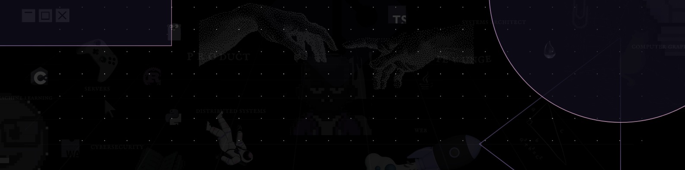

# **Information Technology Technician**

**fevunge | engineer | tlhc**  
    
    

---
## Skills

- **Systems Programming**
- **DevOps & Cloud**

## Training

- 42School
- The BlackHole 
- Bjarne Stroustrup

## Current Focus

- Next-Generation Fleet Management for African Markets
- My first RayCaster
- Gastronomy Consultancy

## GitHub Stats

