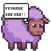

<h2>
Fernando Vunge
</h2>

---------------------------
Coder and full-stack developer, problem solver, and virtuoso learner.
🌍  Luanda, Angola
🖥️  [fevunge](http://fevunge.vercel.app)
✉️  [developervunge@gmail.com](mailto:developervunge@gmail.com)

* ⚡  Keep It Simple, Stupid. And Don't Panic

### Socials

 <a href="https://www.dev.to/fevunge" target="_blank" rel="noreferrer"> <picture> <source media="(prefers-color-scheme: dark)" srcset="https://raw.githubusercontent.com/danielcranney/readme-generator/main/public/icons/socials/devdotto-dark.svg" /> <source media="(prefers-color-scheme: light)" srcset="https://raw.githubusercontent.com/danielcranney/readme-generator/main/public/icons/socials/devdotto.svg" />  </picture> </a> <a href="https://www.gitlab.com/devunge" target="_blank" rel="noreferrer"> <picture> <source media="(prefers-color-scheme: dark)" srcset="undefined" /> <source media="(prefers-color-scheme: light)" srcset="https://raw.githubusercontent.com/danielcranney/readme-generator/main/public/icons/socials/gitlab.svg" />  </picture> </a> <a href="https://www.x.com/vunge_dev" target="_blank" rel="noreferrer"> <picture> <source media="(prefers-color-scheme: dark)" srcset="https://raw.githubusercontent.com/danielcranney/readme-generator/main/public/icons/socials/twitter-dark.svg" /> <source media="(prefers-color-scheme: light)" srcset="https://raw.githubusercontent.com/danielcranney/readme-generator/main/public/icons/socials/twitter.svg" />  </picture> </a>

🤝  I'm open to collaborating on 
    >   -
        - Passionate about open source projects
        - SaaS platforms
        - startup environments
        - minimalistic tools like CLI applications
        - terminal workflows, and Linux systems.

### Badges

<b>My GitHub Stats</b>

